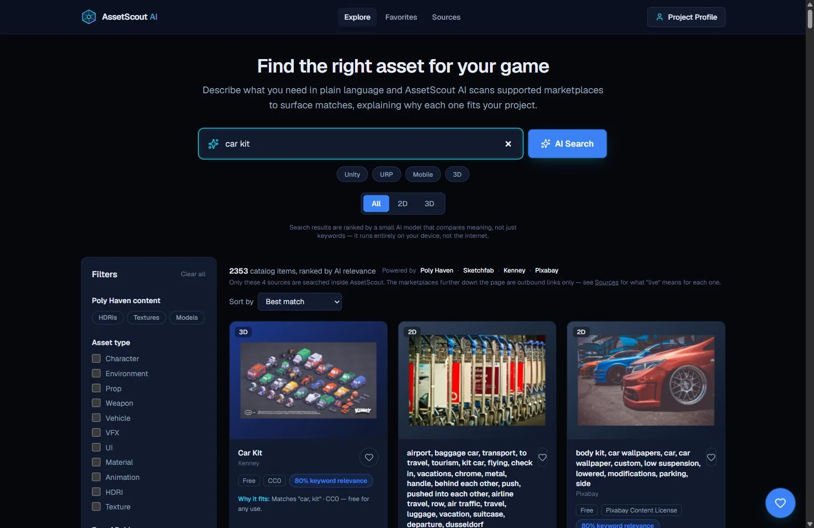
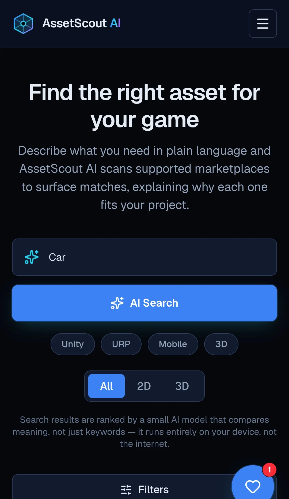

# AssetScout

**A federated search platform for discovering game-development assets across multiple providers.**

## Quick links

[](https://asset-scout-ai.vercel.app)
<br>
[](https://github.com/Eliozk/asset-scout-ai)

## Project status

[](https://nextjs.org)
<br>
[](https://www.typescriptlang.org)
<br>
[](https://vercel.com)
<br>
[](#testing)



## Overview

AssetScout is a full-stack, federated search platform for game-development assets. It queries eight
independent providers in parallel — Poly Haven, Sketchfab, Kenney, Pixabay, ambientCG, Wikimedia
Commons, NASA Image Library, and Openverse — normalizes their very different response shapes into one
consistent result card (price, license, format, engine compatibility), and re-ranks the combined
results with a small AI model that runs **entirely on the visitor's own device**. An optional Gemini
step can translate a natural-language request (English, Hebrew, or otherwise) into a structured search
before any provider is queried — Gemini only *interprets*, it never invents a result, provider, price,
or license, and the entire app works exactly as before with no key configured at all. No paid APIs
required, no cloud AI inference for ranking, no scraping.

## Problem solved

Finding a usable game asset today means opening half a dozen marketplace tabs — each with its own
search syntax, licensing terms, and inconsistent metadata — and manually cross-checking whether a
result is actually free, actually the right format, and actually fits the project. AssetScout
collapses that into one search box — describable in plain language, in English or Hebrew — while being
explicit about which results are genuinely integrated and which are just outbound links to other
marketplaces, rather than pretending to search everywhere.

## Key features

- Natural-language search across 8 live providers, combined and deduplicated, with an **optional
  Gemini query-understanding step** (explicit-submit only, strict validated output, zero-cost local
  fallback on any failure — see [Gemini query understanding](#gemini-query-understanding) below).
- On-device semantic re-ranking with a visible, honest status ("AI Match" vs. deterministic keyword
  relevance — never conflated), and a provider-agnostic hybrid ranker: a strong literal match from a
  non-embedded source can outrank a weak semantic guess instead of always losing to it.
- Category (2D/3D), pricing, license, engine, format, and style filters; quick "project" context chips and a dedicated **Free first** sort that preserves relevance within each pricing group.
- A footer **Send feedback** action that opens a pre-filled GitHub Issue without exposing a personal email address or requiring another backend service.
- Favorites, persisted locally, resolved back to a live/fresh source lookup whenever a favorited item
  can't be recovered from a plain browse query (e.g. Sketchfab, Pixabay) — plus a floating quick-access
  button with a live saved count.
- An honest per-provider status: a partial-failure banner when a source is temporarily down, and a
  distinct notice for queries in an unsupported language — never silently wrong. Every provider fails
  independently — one source being down never breaks the others, Gemini, or the page itself.
- Full-object, non-cropped, non-distorted asset previews (`object-contain`, capped upscaling) with a
  graceful CSS/gradient placeholder for missing or failed thumbnails.
- An outbound "search more marketplaces" hub for 14 non-integrated sources, clearly labeled as
  external links only.
- A `/sources` page documenting exactly what "live" means for every single source — including sources
  that were researched but deliberately not integrated yet, and sources explicitly excluded — and a
  `/legal` page with accurate privacy/terms disclosures.

## Gemini query understanding

When a `GEMINI_API_KEY` is configured, submitting a search (pressing Enter or the search button — never
on every keystroke) first sends your search phrase to Google's Gemini API to be interpreted into a
strict, validated `SearchIntent`: a normalized English query, up to a handful of matched asset
types/engines/styles/platforms (only from AssetScout's own existing enums — Gemini can't invent a new
one), a free/paid signal, and a short factual one-line summary of what it understood. AssetScout then
searches its real providers with that normalized query — Gemini itself never returns a provider name,
URL, thumbnail, price, or license, and never picks which providers to call.

**Fallback is automatic and total.** Missing/invalid key, timeout, network error, HTTP 429/quota
exhaustion, any 4xx/5xx, malformed JSON, a response that fails validation, or an unsupported language —
every one of these falls straight back to the exact same local keyword/semantic search this app already
had, with no empty page and no visible error. At most one Gemini request is made per explicitly
submitted search, it is never retried, and a small per-instance cache + in-flight request coalescing
avoid redundant calls for repeated identical searches (this cache is **not** shared across serverless
instances — see code comments in `src/app/api/query-understand/route.ts`).

Your original typed text is always preserved and shown in the search box, even after a successful
Gemini rewrite — only the actual provider queries use the translated text.

## Integrated providers

Results from these eight sources are fetched, normalized, and ranked **inside** AssetScout, all at zero
cost — four need no API key or account at all beyond the original four's existing setup:

| Provider | Mode | What's returned | License | Key required? |
|---|---|---|---|---|
| **Poly Haven** | Live API (served from a periodically refreshed static snapshot) | HDRIs, textures, 3D models | CC0 | No |
| **Sketchfab** | Live API, real server-side search | 3D models | Varies per model, shown on every card | No (optional token raises rate limit) |
| **Pixabay** | Live API, real server-side search | Photos, illustrations, vectors | Pixabay Content License | Yes |
| **Kenney** | Authorized indexed catalog (versioned static snapshot) | 2D sprites, 3D kits, textures | CC0 | No |
| **ambientCG** | Live API, real server-side search | PBR materials, HDRIs | CC0 | No |
| **Wikimedia Commons** | Live API, real server-side search | Photos, scans, illustrations | Varies per file, shown on every card | No |
| **NASA Image Library** | Live API, real server-side search | Space & science photography | Generally not copyrighted in the US (not CC) | No |
| **Openverse** | Live API, real server-side search (anonymous) | Openly-licensed images | Varies per result, shown on every card | No |

## Researched, not yet implemented

Also verified eligible against their own official documentation during this milestone's provider
research, but deliberately not wired up yet (see `/sources` for the full reasons — mostly "needs a free
account/key" or "catalog too broad to scope safely yet"): **Openclipart**, **Internet Archive**,
**Europeana**, **Smithsonian Open Access** (all `LIVE_API`-eligible), and **Game-Icons.net** (an
authorized static catalog, like Kenney's). None of these are searched or claimed as integrated today.

## External marketplace links

These 14 marketplaces are **outbound links only** — AssetScout does not search, scrape, retrieve, or
verify anything from them:

Unity Asset Store · Fab · itch.io · OpenGameArt · CraftPix · CGTrader · TextureCan · ProductionCrate ·
ArtStation Marketplace · GameDev Market · TurboSquid · Mixamo · CGBookcase · Quaternius

Five more sources (Freesound, BlenderKit, Blend Swap, Free3D, Adobe Substance 3D Assets) were
researched and explicitly excluded — their own terms don't permit this use, or no lawful automated
access exists at all. See `/sources` for the specific reason for each.

**In short: eight providers return normalized results inside AssetScout; 14 marketplaces are external
links only, opened in a new tab; 5 more were researched and excluded. AssetScout never claims "all
marketplaces searched," and always verify a result's actual license, price, availability, and download
rights on its original source before using it.**

## Search & ranking approach

Every result is normalized into one shape before it reaches a component, then ranked in two layers:

1. **Deterministic keyword relevance** — a pure, unit-tested AND-match over name/description/tags,
   always available, always explainable ("Matches 'car, kit'").
2. **On-device semantic re-ranking** — once a small (~23MB, q8-quantized) sentence-embedding model
   (`Xenova/all-MiniLM-L6-v2`, via [Transformers.js](https://huggingface.co/docs/transformers.js))
   finishes loading in the browser, it compares the meaning of the query against a precomputed
   embedding for every Poly Haven asset. Sources without a precomputed embedding (Sketchfab, Pixabay,
   Kenney) are never silently excluded or unconditionally demoted — they keep their own deterministic
   score and compete directly against semantic scores on the same 0–100 scale, so a strong literal
   match still wins over a weak semantic guess.

**Honesty boundary:** the model is English-only. A query in Hebrew, Arabic, or another non-Latin
script is detected and shown an explicit "no English matches for this query" state, instead of either
failing silently or flooding the page with results reordered by a model that has no real signal for
that language. A multilingual model was researched and benchmarked (`poc/multilingual-hebrew-search/`)
but is not shipped — it's roughly 6× the download size, a deliberate tradeoff not yet made.

## Architecture

```
Browser
  │
  ├─ AI Search box ─── explicit submit ──▶ /api/query-understand (Gemini, optional)
  │                     │                        │ success: validated SearchIntent (English)
  │                     │                        │ ANY failure: falls back silently
  │                     ▼                        ▼
  │              on-device MiniLM embedding   query text used for provider search
  │              (Transformers.js, WASM/WebGPU)
  │              ranks results by meaning, not just keyword overlap
  │
  └─ /api/providers/*  ── our own Route Handlers (server-side only)
        ├─ polyhaven   → serves a versioned static catalog — no live fetch on a normal request
        ├─ sketchfab   → live search against Sketchfab's public API (Next.js fetch cache, ~1h)
        ├─ pixabay     → live search against Pixabay's API (Next.js fetch cache, 24h — required
        │                 by Pixabay's API terms)
        ├─ kenney      → statically bundled catalog, zero network calls at all
        ├─ ambientcg   → live search against ambientCG's public API (no key)
        ├─ wikimedia   → live search against Wikimedia Commons' MediaWiki API (no key)
        ├─ nasa        → live search against NASA's Image and Video Library API (no key)
        └─ openverse   → live search against Openverse's public API (anonymous, no key)
```

Gemini interpretation and provider retrieval are two separate concepts, always labeled separately in
the UI — Gemini never "searches," it only produces the structured query the real providers are searched
with.

```
src/
  app/                       Routes: "/" (Explore), "/favorites", "/sources", "/legal"; layout,
                             metadata, sitemap.ts, robots.ts, not-found.tsx, error.tsx
    api/providers/*/route.ts Server-only Route Handlers — the only code allowed to call an external
                             provider API directly or read its API key
    api/query-understand/    Server-only Route Handler for Gemini — the only code allowed to call
                             Gemini or read GEMINI_API_KEY; per-instance cache + in-flight coalescing
  components/                layout / search / filters / assets / states
  domain/
    asset/                   Normalized AssetSearchResult model, AssetSearchQuery, AssetSearchProvider contract
    search-intent/           Validated SearchIntent produced by Gemini query understanding
  lib/
    providers/<name>/        fetch-assets.ts (server-only), normalize.ts, raw-types.ts, provider.ts
    gemini/                  Server-only Gemini SDK call, prompt, response schema, strict re-validation
    search/                  Pure filter/sort/tokenize/relevance/ranking/apply-search-intent — no React, no I/O
    semantic/                Browser-only Transformers.js runtime, embedding manifest, catalog-version hash
    marketplaces/            Outbound-link registry for the 14 external marketplaces (zero network calls)
    sources/                 Registries the /sources page renders from — integrated, researched-not-built, rejected
  data/                      Versioned static Poly Haven + Kenney catalogs (committed, not caches)
  hooks/                     useAssetSearch, useSemanticRanking, useFavorites, useQueryUnderstanding
scripts/                     One-off generation scripts (never run at build time)
poc/                         Isolated, non-production research scripts (never imported by the app)
public/semantic-search/      Generated embeddings.bin + manifest.json, served as static files
```

Key architectural rules this codebase follows (enforced version in `AGENTS.md`):

- **UI components never see provider-specific shapes** — everything is normalized to
  `AssetSearchResult` first.
- **Filter/sort/ranking logic is pure** — no React, no `window`/`localStorage`, unit tested in isolation.
- **External providers are called server-side only**, from that provider's own Route Handler.
- **`localStorage` access is SSR-safe**, funneled through `lib/storage.ts` / `useSyncExternalStore`.
- **No state-management library, no `any`.**

### Poly Haven catalog strategy

Poly Haven's `/assets` endpoint returns its entire catalog in one ~3MB response with no
search/pagination support. Fetching that live on every request is slow and unreliable on a
serverless platform, where a process-local cache doesn't survive across cold-started instances.
Instead, the catalog is fetched and normalized once, deliberately, via `npm run polyhaven:generate`,
and committed as a versioned static file. The route serves this directly — zero network calls at
request time — falling back to a live fetch only if that file is ever missing or invalid.

The semantic embeddings artifact is generated *from* that same committed catalog (never an
independent live fetch), so the two can never silently drift — enforced by a committed consistency
test. Refresh both together with `npm run catalog:refresh`.

## Reliability and security

- `PIXABAY_API_KEY` / `SKETCHFAB_API_TOKEN` are read only inside server-only Route Handlers — never
  imported by any client component, and verified absent from the built client bundle.
- Error responses from every API route return a short, generic message — never the upstream URL, raw
  upstream error body, or whether a token/key is configured.
- Standard security headers (`X-Content-Type-Options`, `X-Frame-Options`, `Referrer-Policy`,
  `Permissions-Policy`, HSTS) are set in `next.config.ts`. A `Content-Security-Policy` was
  deliberately not added — the local model download (Hugging Face's CDN, multiple/rotating hosts)
  isn't fully enumerable without live testing every host, and an under-tested CSP risks silently
  breaking model loading, remote images, or the external marketplace links.
- No user accounts, payment processing, advertising scripts, or tracking cookies. Anonymous,
  cookie-free traffic statistics are collected with Vercel Web Analytics.
- See [`/legal`](https://asset-scout-ai.vercel.app/legal) for the full privacy/terms notice — it
  makes no guarantee of permanent zero cost or blanket legal compliance in every jurisdiction, and
  says so directly.

## Responsive design

The layout is mobile-first (`grid-cols-1` by default, expanding at `sm:`/`xl:` breakpoints), with a
collapsible mobile nav and a floating Favorites shortcut that stays reachable with one tap instead of
being buried behind a menu.



## Technology stack

- [Next.js 16](https://nextjs.org) (App Router, Turbopack, React Server Components), deployed on
  Vercel's Hobby (free) tier.
- [React 19](https://react.dev) / TypeScript (strict mode, no `any`).
- [Tailwind CSS 4](https://tailwindcss.com) (CSS-first theme, no `tailwind.config.js`).
- [@huggingface/transformers](https://huggingface.co/docs/transformers.js) (Transformers.js) for
  in-browser semantic search — no server-side ML inference, no cloud AI for ranking of any kind.
- [@google/genai](https://www.npmjs.com/package/@google/genai) — official Google Gemini Developer API
  SDK, used server-only for the optional query-understanding step (see above). Never imported by client
  code.
- [lucide-react](https://lucide.dev) for icons.
- [Vitest](https://vitest.dev) + [Testing Library](https://testing-library.com) for unit/component
  tests.

## Local setup

```bash
npm install
npm run dev
```

Open [http://localhost:3000](http://localhost:3000).

## Environment variables

Copy `.env.example` to `.env.local` and fill in real values — **never commit `.env.local`** (already
gitignored).

| Variable | Required? | Notes |
|---|---|---|
| `PIXABAY_API_KEY` | Yes, for Pixabay results | Free key from [pixabay.com/api/docs](https://pixabay.com/api/docs/). Read server-side only; omitting it just omits Pixabay from results — everything else still works. |
| `SKETCHFAB_API_TOKEN` | No | Sketchfab's search works fully unauthenticated. An optional free token raises your own rate limit. |
| `GEMINI_API_KEY` | No | Enables Gemini query understanding. Free key from [Google AI Studio](https://aistudio.google.com/apikey) — no billing account needed. Omitting it just runs local search exactly as before; every Gemini failure mode falls back the same way. Read server-side only, never sent to the browser. |
| `GEMINI_MODEL` | No | Overrides the Gemini model (defaults to `gemini-2.5-flash-lite` — current stable, free-tier, structured-output-capable). |
| `NEXT_PUBLIC_SITE_URL` | No | This app's own public URL, used for canonical links/sitemap/OG metadata. Falls back to `http://localhost:3000`. |

ambientCG, Wikimedia Commons, NASA Image Library, and Openverse need no environment variable at all —
their search runs fully unauthenticated/anonymously, same as Sketchfab's default mode.

## Testing

```bash
npm run lint     # ESLint (eslint-config-next) — passing
npm run test     # Vitest — 548 automated tests passing
npm run build    # Production build (Turbopack) — verified
npm run start    # Serve the production build locally
```

Tests cover pure filter/sort/tokenize/relevance/ranking logic, provider response parsing against
untrusted-input type guards, catalog/embeddings consistency, and key UI components.

## Deployment

Deployed on Vercel's **Hobby (free) tier** — no paid add-ons, no background jobs, no database.

1. Push to GitHub.
2. Import into Vercel.
3. Add the environment variables above (at minimum `PIXABAY_API_KEY`).
4. Deploy — `next build` / `next start` are Vercel's defaults, no changes needed.

## Known limitations

- Hebrew and other non-Latin-script queries are honestly unsupported for **on-device AI ranking**
  without Gemini configured — the local semantic model is English-only (see
  [Search & ranking approach](#search--ranking-approach)). With Gemini configured, an explicitly
  submitted Hebrew search is translated to English before searching/ranking; without it, the same
  honest "no English matches" notice as before is shown, never an empty page.
- Gemini query understanding, when configured, only fires on explicit submission (not while typing) and
  is best-effort — a confident local fallback always exists, and Gemini's own free-tier limits/terms can
  change (see `/legal`).
- The per-instance Gemini response cache/rate-limiter is **not** shared across serverless
  instances/regions on Vercel — it reduces redundant calls within one warm instance, not a global or
  abuse-proof control.
- Poly Haven's static catalog is a point-in-time snapshot — new releases won't appear until someone
  runs `npm run catalog:refresh`.
- Kenney's catalog covers only its ~25 most recent public-feed releases, not its full historical library.
- Sketchfab/ambientCG/Wikimedia Commons/NASA/Openverse result relevance depends partly on each source's
  own search relevance before AssetScout's own filtering/re-ranking applies.
- Wikimedia Commons, NASA, and Openverse results are general openly-licensed images, not verified
  game-ready asset packs — shown honestly as flat 2D texture/reference material, not claimed otherwise.
- ambientCG's own `type` filter parameter was found (live-verified) to silently return the unfiltered
  catalog for asset kinds with zero current matches rather than zero results — AssetScout filters by the
  real per-asset `dataType` field instead, and only surfaces Material/HDRI kinds it has a confident
  mapping for.
- The 14 external marketplaces are outbound links only; AssetScout has no visibility into what they return.
- 5 more researched sources are explicitly excluded (see `/sources`), and 5 verified-eligible sources
  (Openclipart, Internet Archive, Europeana, Smithsonian Open Access, Game-Icons.net) aren't built yet.
- Operating on free tiers today is a description of how the project currently runs, not a permanent
  guarantee — see `/legal`.

## Roadmap

- Decide on and ship (or explicitly reject) the multilingual embedding model from
  `poc/multilingual-hebrew-search/` as an alternative/complement to Gemini for on-device ranking.
- Build the remaining verified-eligible sources: Openclipart, Internet Archive, Europeana, Smithsonian
  Open Access (all need a free key), and Game-Icons.net as a static authorized catalog.
- Register a free Openverse OAuth2 client for a higher rate-limit tier than the current anonymous mode.
- Pagination/infinite scroll for very large result sets.
- A persisted "Project Profile" (engine, render pipeline, target platform) that search/ranking can use
  as durable context.

## Attribution and legal notes

This project's own source code does not yet have a chosen open-source license. Third-party data and
models keep their own original licenses, always shown per-result where they vary:

- **Poly Haven** assets — CC0 (public domain).
- **Kenney** assets — CC0 (public domain).
- **Sketchfab** models — license varies per model, shown on every result card.
- **Pixabay** images — Pixabay Content License.
- **ambientCG** materials/HDRIs — CC0 (public domain).
- **Wikimedia Commons** files — license varies per file, shown on every result card; unverified/missing
  license metadata is labeled unknown, never assumed free.
- **NASA Image Library** images — generally not copyrighted in the US per NASA's own guidelines (not a
  Creative Commons grant); never use the NASA insignia/logo to imply endorsement.
- **Openverse** results — license varies per result, shown on every result card using Openverse's own
  attribution text. Made with Openverse — AssetScout is not endorsed or certified by Openverse.
- **`Xenova/all-MiniLM-L6-v2`** (the local semantic model) — Apache-2.0, via
  [Transformers.js](https://huggingface.co/docs/transformers.js).
- **Gemini** (optional query understanding) — governed by
  [Google's Gemini API Additional Terms of Service](https://ai.google.dev/gemini-api/terms), not a
  Creative Commons license; see `/legal` for what data is sent and when.

AssetScout is a discovery tool, not a seller or licensor of any asset — see
[`/legal`](https://asset-scout-ai.vercel.app/legal) for the full notice.

---

Built by **Elioz Kolani** — [GitHub](https://github.com/Eliozk) ·
[LinkedIn](https://www.linkedin.com/in/elioz-kolani)
